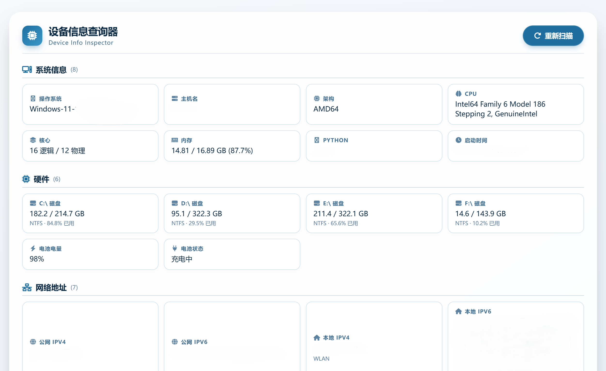

# 设备信息查询器 · Device Info Inspector

一款 Windows 桌面工具，**本地采集并展示**设备、系统、网络、浏览器信息。  
支持 **Web 界面（pywebview）** 和 **tkinter 兼容界面** 双版本，**自动降级**，兼容性强。

[English](README.en.md) | 简体中文

> 所有数据均在本机采集与展示，**不会上传到任何服务器**。部分信息依赖第三方公开 API（IP 归属地查询等）。

---

## 截图



---

## 功能特点

- **系统信息**：操作系统、主机名、CPU 型号与核心数、内存、磁盘分区、电池状态
- **网络信息**：公网 IPv4/IPv6、本地 IPv4/IPv6、MAC 地址、网关、DNS 服务器
- **IP 地理位置**：国家 / 地区 / 城市、经纬度、时区、ISP、组织、AS
- **浏览器指纹**：Canvas、WebGL 供应商 / 渲染器、音频指纹、字体数量、User-Agent
- **浏览器环境**：语言、平台、屏幕分辨率、像素比、CPU 核心、设备内存、触控支持、Cookie、DNT
- **双版本自动切换**：有 WebView2 时用 Web 界面，没有时自动降级到 tkinter
- **一键复制**：每个数据项右上角都有复制按钮，鼠标悬停显示
- **多 API 容错**：公网 IP / 地理位置等多个接口自动 fallback，保证成功率

---

## 快速开始

### 方式 1：下载 exe（推荐）

从 [Releases](https://github.com/clocktool/SysInfo/releases) 下载最新的 `SysInfo.exe`，**双击运行**。

> 系统要求：Windows 10 / 11（64 位）

### 方式 2：从源码运行

```bash
git clone https://github.com/clocktool/SysInfo.git
cd SysInfo
pip install -r requirements.txt
python launcher.py
```

---

## 依赖

- **Python** >= 3.10（推荐 3.11 / 3.12 / 3.14）
- [pywebview](https://pywebview.flowrl.com/) == 4.4.1 —— Web 界面
- [psutil](https://github.com/giampaolo/psutil) —— 系统信息采集
- [requests](https://requests.readthedocs.io/) —— IP 查询 API

安装：

```bash
pip install -r requirements.txt
```

---

## 项目结构

```text
SysInfo/
├── launcher.py           # 启动器：检测环境，选择高级版或兼容版
├── backend_web.py        # 高级版后端（pywebview + 本地 HTTP 服务）
├── backend_lite.py       # 兼容版后端（tkinter）
├── collectors.py         # 数据采集模块（系统、网络、地理）
├── web/                  # 前端资源
│   ├── index.html
│   ├── style.css
│   └── app.js
├── app.ico               # 程序图标
├── requirements.txt
├── LICENSE
├── README.md
└── README.en.md
```

---

## 打包为 exe

```bash
pyinstaller --onefile --windowed --name SysInfo ^
  --icon "app.ico" ^
  --add-data "web;web" ^
  --hidden-import=webview ^
  --hidden-import=webview.platforms.edgechromium ^
  launcher.py
```

打包完成后 exe 位于 `dist/SysInfo.exe`。

> 提示：如果图标没生效，把 exe 改名或换个文件夹（Windows 图标缓存机制）。

---

## 使用说明

1. 双击 `SysInfo.exe`，程序会自动采集并展示信息
2. 每个数据项右上角有 **复制按钮**（鼠标悬停显示）
3. 点右上角 **"重新扫描"** 可重新采集

---

## 常见问题

### Q1：公网 IP 显示"无"？

可能被墙或接口限流。程序会**自动尝试多个 API**，但仍有失败可能。

- 检查网络连接
- 稍后重试
- 或在 `collectors.py` 里添加更多 API

### Q2：打开后显示 404？

`web/` 目录未正确打包。重新打包时确保加上 `--add-data "web;web"`。

### Q3：为什么本地 IP 显示不全？

部分 IP（`127.0.0.1`、`169.254.x.x`、`fe80::` 等）是**回环 / APIPA / link-local 地址**，**不代表真实网络地址**，已自动过滤。

### Q4：WebView2 是什么？需要装吗？

**WebView2 Runtime** 是微软的浏览器内核组件，用于显示 Web 界面。

- **Windows 11**：系统自带
- **Windows 10**：多数已通过 Windows Update 安装

如果没装，程序会**自动降级到 tkinter 界面**，功能不受影响。

---

## 开发

如需添加新信息项：

1. **采集端**：修改 `collectors.py` 的 `collect_all()`，在返回的字典里加字段
2. **Web 端**：修改 `web/app.js` 的 `render()`，加对应的 `item(...)`
3. **tkinter 端**：修改 `backend_lite.py` 的 `_render()`，加对应行

---

## 开源协议

本项目采用 [MIT License](LICENSE)。

---

## 致谢

- [pywebview](https://pywebview.flowrl.com/) — Lightweight Web UI
- [psutil](https://github.com/giampaolo/psutil) — System information
- [Font Awesome](https://fontawesome.com/) — Icons
- [ip-api.com](http://ip-api.com/) / [ipapi.co](https://ipapi.co/) — IP geolocation

---

如果这个项目对你有帮助，欢迎点个 Star。
